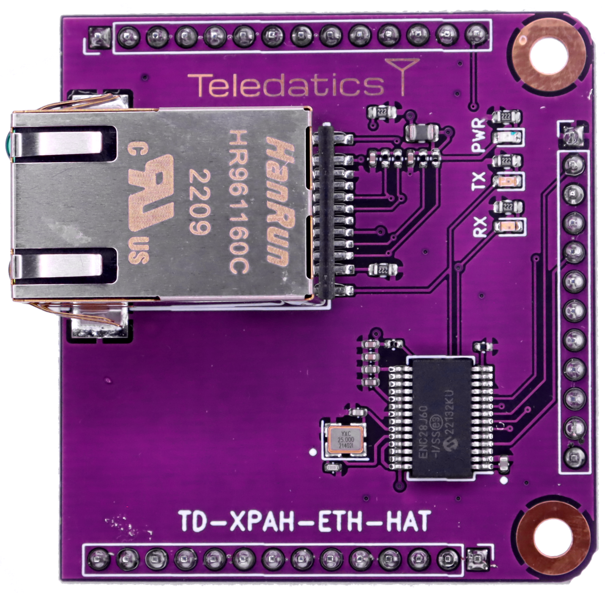

# TD-XPAH-ETH-HAT
## Ethernet Accessory Add-On

The **TD-XPAH-ETH-HAT** was developed from the Teledatics Kicad daughterboard 'hAT' [template](https://github.com/teledatics/TD-XPAH_hAT_template). The Kicad template can be installed in Kicad 6.x or newer versions.

The Teledatics GUI <i>standalone</i> mode firmware automatically recognizes and initializes the Ethernet hAT on boot.

The Wi-Fi IP address is shared with the Ethernet device.

The **TD-XPAH-ETH-HAT** uses the ENC28J60 SPI-Ethernet chip that converts Ethernet signals and sends them over the SPI bus. All required software and drivers are included in the open source Teledatics [GUI firmware](https://github.com/teledatics/nrc7292_sdk/tree/teledatics_gui) source code tree on our github repository.