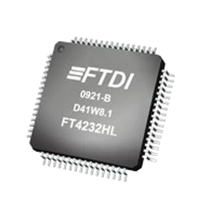
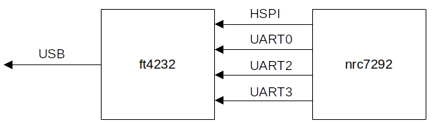
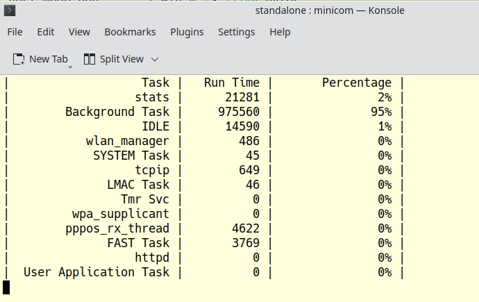

# TD-XPAH Hardware Design

## Newracom nrc7292 Chip

The **TD-XPAH** is designed around the [Newracom nrc7292](https://newracom.com/products/nrc7292) chip. This chip contains two embedded ARM Cortex-m series micro-controllers as well as peripheral connection interfaces and I/O pins. The nrc7292 contains a full implementation of the IEEE 802.11ah specifications and supports the various frequencies for 802.11ah in different world regions and countries.

The **TD-XPAH** is currently limited to the 902 - 928 MHz frequency band and supports 802.11ah in the United States, Canada, Australia, New Zealand, Japan and South Korea.

The [nrc7292](https://newracom.com/products/nrc7292) has the following features & I/O:

- 700 - 950 MHz frequencies
- ARM Cortex-m0 & m3 MCU's
- 752 KB RAM
- 2 MB flash
- 4x I2C interface
- 2x SPI interface
- 4x UART serial ports
- 8x PWM
- 6x high precision timers
- 4x 9-bit ADC's
- 32x GPIO pins
- 3x watchdog timers

The [nrc7292](https://newracom.com/products/nrc7292) multiplexes I/O. This means that certain pins are able to support multiple interfaces or I/O features. The behavior of these pins is determined at boot time by the <i>standalone</i> mode firmware.

## FTDI FT4232 USB Chip

The **TD-XPAH** is designed to run completely over a USB-C connection. This is accomplished via the [FTDI ft4232h](https://ftdichip.com/products/ft4232hl/) USB translation chip. The FTDI chip translates select nrc7292 interfaces & I/O and streams them over a USB connection. This greatly simplifies interfacing and development as no special cables or hardware connections are needed other than a USB cable.

## TD-XPAH USB SPI & UART

*hardware port mapping*

The TD-XPAH connects the nrc7292 SPI interface and three UART serial ports to the USB bus through the ft4232h chip.

*host mode*

When the nrc7292 is set to <i>host</i> mode it loads on-board firmware over the SPI interface to enable communication with a Linux host system. The firmware uses the standard 4-pin SPI interface as well as an additional GPIO for handshaking. These pins are referred to as <i>host SPI</i> or HSPI in Newracom documentation.

- HMOSI
- HMISO
- HSCK
- HCE
- HIRQ

*standalone mode*

When the nrc7292 is set to <i>standalone</i> mode it boots an on-board operating system from flash memory. Although <i>standalone</i> mode does not need communication with external systems or interfaces it is useful to use UART serial ports for debugging and I/O.

The Newracom <i>standalone</i> mode SDK is based on the [Espressif ESP SDK](https://docs.espressif.com/projects/esp-idf/en/latest/esp32/), which itself builds upon [FreeRTOS](https://www.freertos.org/). Much of the Newracom SDK is open source, though major functionality is contained in a closed source binary only library. The closed source binary includes all Wi-Fi functionality as well as direct access to the hardware interface & I/O.

The **TD-XPAH** hardware connects three UART serial ports to the FTDI USB chip that can be used during <i>standalone</i> mode development and testing. These are the nrc7292 UART0, UART2, and UART3. UART3 is used as the default SDK debug console and has a simple command line interface. UART3 is also used for firmware download via the Newracom Firmware Flash tool.

UART0 and UART2 are free for other uses. The [Teledatics GUI](https://github.com/teledatics/nrc7292_sdk/tree/teledatics_gui) implements a PPP connection over UART2 that can be used to communicate via TCP/IP over the USB cable.

	pppd -detach noauth local nocrtscts modem /dev/ttyUSB2 192.168.200.3:192.168.200.4 115200
	
The [Teledatics GUI](https://github.com/teledatics/nrc7292_sdk/tree/teledatics_gui) uses UART0 to graph running threads and CPU loading. Both of these UART ports can be re-tasked for other purposes if desired.

## Daughterboard Pinout

**TD-XPAH** accessory 'hAT' add-on boards are designed using a [Kicad 6.x template](https://github.com/teledatics/TD-XPAH_hAT_template) that makes the nrc7292 chip interfaces available via the daughterboard pins.

Available pins:

- +5V 
- +3.3V
- Ground
- Reset
- JTAG
- Mode pins
- I2C
- HSPI
- SPI
- GPIO
- UART
- ADC
- PWM