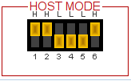

# TD-XPAH HOST MODE

## Linux USB Wi-Fi Dongle

When configured for <i>host</i> mode the TD-XPAH becomes a USB Wi-Fi dongle that is attached via a USB cable to an external Linux system.

<i>Host</i> mode is configured via on-board DIP switches set to the following settings.

<host mode DIP switch pic>

## Host Mode Drivers

There are two Linux drivers that must be installed and configured to enable a Linux system to communicate with the TD-XPAH. These drivers are the <i>Newracom</i> [nrc7292_sw_pkg](https://github.com/teledatics/nrc7292_sw_pkg) <i>host</i> mode driver and the <i>Teledatics</i>  [ftdi-spi-linux](https://github.com/teledatics/ftdi-spi-linux) USB-SPI translation driver.

The <i>Newracom</i> driver connects the Linux kernel to the Newracom nrc7292 801.11ah chip inside of the module on the TD-XPAH board. Since the Linux kernel and Wi-Fi userspace daemons do not currently support 802.11ah natively, the <i>Newracom</i> driver makes the device appear to be a traditional 802.11a device. Please refer to the Newracom [frequency documentation](https://github.com/teledatics/nrc7292_sw_pkg/blob/master/package/host/doc/UG-7292-003-S1G_Channel.pdf) for the proper frequency translation settings. These 802.11a frequency settings will be automatically translated to 802.11ah sub-1 GHz frequencies by the <i>Newracom</i> driver and firmware.

The <i>Newracom</i> driver requires nrc7292 [firmware](https://github.com/teledatics/nrc7292_sw_pkg/blob/master/package/host/evk/binary/nrc7292_cspi.bin), which is copied to the Linux /bin/firmware directory.

The <i>Newracom</i> driver loads as follows and communicates over a SPI bus.
    
    host driver -> SPI bus -> Linux kernel

## Teledatics USB-SPI Driver

The **TD-XPAH** hardware maps the nrc7292 SPI bus to the USB bus via the on-board FTDI USB translation chip. The FTDI chip is able to translate several different bus types and send their streams over USB including SPI, I2C, JTAG, UART or binary buses such as an FPGA.

In order to correctly map the nrc7292 SPI bus over USB, Teledatics developed a USB-SPI mapping driver that sits in between the <i>Newracom</i> driver and the Linux kernel.

When compiled and installed in the external Linux system, the <i>Teledatics</i> driver will load automatically whenever the **TD-XPAH** is connected to the external Linux system.

	host driver -> USB-SPI driver -> Linux kernel
	
## Blacklisting Linux USB-UART Driver

Most Linux systems come pre-configured with a driver that recognizes the FTDI USB chip and automatically loads four serial devices mapped as /dev/ttyUSB[0-3]. This driver is used during development on a **TD-XPAH** in <i>standalone</i> mode. But the driver must be disabled or 'blacklisted' when running the **TD_XPAH** in <i>host</i> mode.

To blacklist the FTDI USB-UART driver run the following from the command line:

	echo "blacklist ftdi_sio" > /etc/modprobe.d/blacklist-ftdi_sio.conf
	
Reboot the Linux system and the FTDI serial drivers will no longer load automatically.

If you wish to reverse this procedure, simply delete the file,

	/etc/modprobe.d/blacklist-ftdi_sio.conf