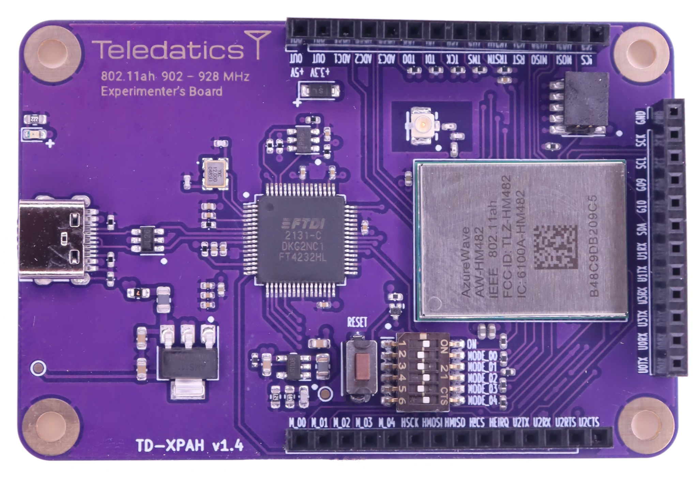

# TD-XPAH Platform

***********
### Introduction
***********

This document is intended to help you set up the software development environment and the hardware for the Teledatics TD-XPAH development platform. 

***********
### Background
***********
The TD-XPAH development platform is an IEEE [802.11ah](https://en.wikipedia.org/wiki/IEEE_802.11ah) device that follows the Wi-Fi Alliance [Halow&#8482;](https://www.wi-fi.org/downloads-registered-guest/Wi-Fi_CERTIFIED_HaLow_Technology_Overview_20211102.pdf/36879) standard. IEEE 802.11ah is a Wi-Fi protocol that uses lower frequencies than traditional Wi-Fi routers and clients. Halow&#8482; provide a number of benefits:

1. Longer range 
2. Lower power
3. Many client connections per access point

While other long-range wireless solutions exist, many of these are not compatible with existing Internet standards & protocols and require translation software or hardware. IEEE 802.11ah is compatible with standard Internet protocols and does not need a gateway or other protocol translator.

***********
### Modes of Operation
***********

The TD-XPAH can operate in one of two modes. These modes are known as <i>host</i> mode and <i>standalone</i> mode.

The modes of operation are configure by on-board DIP switch settings. 

#### Host Mode

When configured for <i>host</i> mode, the TD-XPAH works as a USB Wi-Fi dongle. The <i>host</i> mode device must be connected by a USB cable to an external Linux system.

<i>Host</i> mode requires Linux drivers and firmware that enable the TD-XPAH to operate as a Linux Wi-Fi device. These drivers and firmware are available from the [Teledatics github](https://www.github.com/teledatics)  repositories.

When operating in <i>host</i> mode communication with the Linux kernel & operating system is through the USB cable.

#### Standalone Mode

When configured for <i>standalone</i> mode, the TD-XPAH boots an on-board operating system from flash memory. The <i>standalone</i> mode device draws only power from the USB connection.

<i>Standalone</i> mode does not need to communicate with external systems and runs as a self-contained device. 

Three serial UART ports are available in <i>standalone</i> mode. These serial ports are exposed over the USB cable when the device is attached to a Linux system. The communication ports are not necessary for <i>standalone</i> mode operation. They are provided as a means of communicating with the <i>standalone</i> mode device during development and testing.