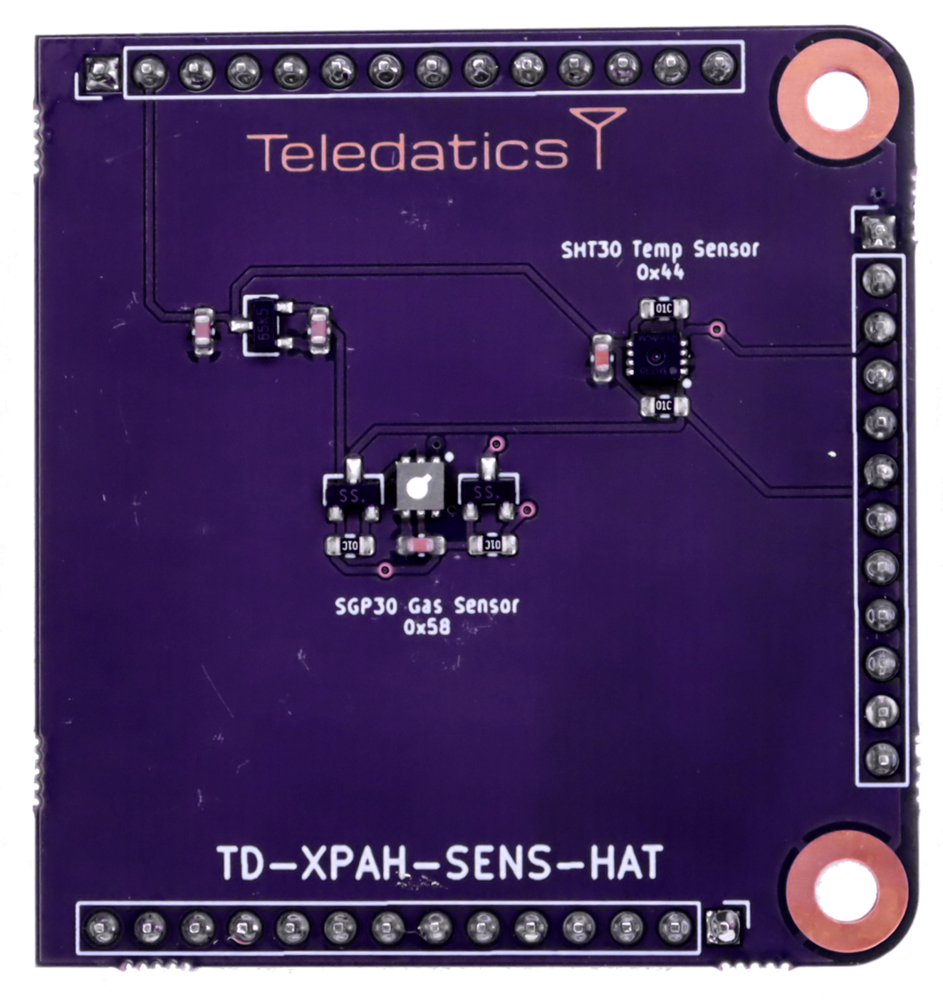

# TD-XPAH-SENS-HAT

## Air Quality Sensor Add-On

The **TD-XPAH-ETH-HAT** was developed from the Teledatics Kicad daughterboard 'hAT' [template](https://github.com/teledatics/TD-XPAH_hAT_template). The Kicad template can be installed in Kicad 6.x or newer versions.

The Teledatics GUI <i>standalone</i> mode firmware automatically recognizes and initializes the Air Quality Sensor hAT on boot.

The **TD-XPAH-SENS-HAT** uses the SGP30 temperature & humidity sensor chip and the SGP30 CO2 & VoC (volatile organic compounds) sensor chip. All required software and drivers are included in the open source Teledatics [GUI firmware](https://github.com/teledatics/nrc7292_sdk/tree/teledatics_gui) source code tree on our github repository.

The Teledatics GUI will display temperature, humidity, CO2 PPM, and VoC PPM updated every 5 seconds via a web socket.

Teledatics developed an I2C 'C' language [SGP30 library](https://github.com/teledatics/nrc7292_sdk/tree/teledatics_gui/package/standalone/lib/sgp30) and an I2C 'C' language [SHT30 library](https://github.com/teledatics/nrc7292_sdk/tree/teledatics_gui/package/standalone/lib/sht30) to support the **TD-XPAH-SENS-HAT**.