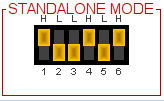
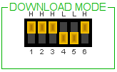
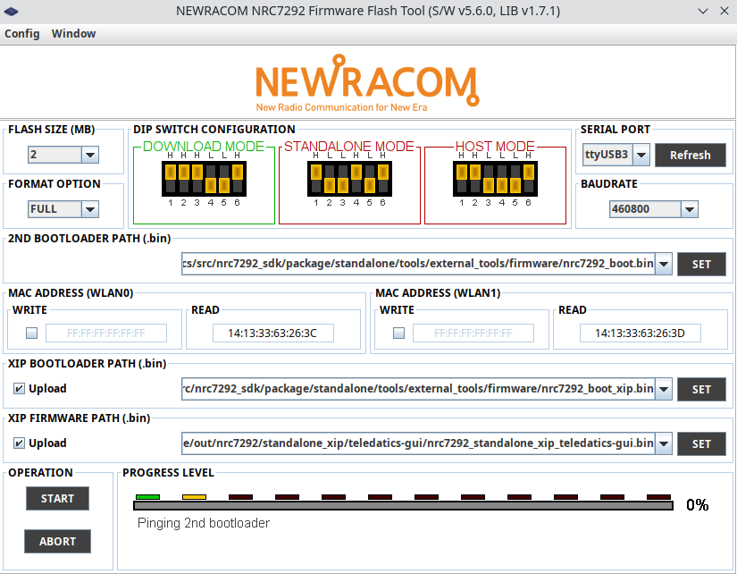

# TD-XPAH Standalone Mode

## Standalone System

When configured for <i>standalone</i> mode the TD-XPAH boots from flash memory and runs as a standalone system.

<i>Standalone</i> mode is configured via on-board DIP switches set to the following settings.

<standalone DIP switch pic>

## Standalone Firmware

In order to run in <i>standalone</i> mode the device must first be updated by downloading the <i>standalone</i> mode firmware to flash memory. All **TD-XPAH** devices are tested both in <i>standalone</i> mode and <i>host</i> mode before they are shipped to you. If you want to run the **TD_XPAH** in <i>standalone</i> mode without updating the firmware, simply confirm that the DIP switches are set to the standalone mode settings and reboot your device.

The latest <i>standlone</i> mode firmware can be found on the Teledatics github repository [here](https://github.com/teledatics/nrc7292_sdk/blob/teledatics_gui/package/standalone/sdk/apps/teledatics-gui/nrc7292_standalone_xip_teledatics-gui.bin). Your **TD-XPAH** was updated with the latest <i>standalone</i> mode firmware available at time of shipping. If you wish to update the firmware, you will need to download a new standalone mode binary to the device.

## Downloading Firmware

Firmware is downloaded to the **TD-XPAH** via the Newracom [Firmware Flash Tool](https://github.com/teledatics/nrc7292_sdk/blob/teledatics_gui/package/standalone/tools/external_tools/FirmwareFlashTool.exe). The flash tool is written in Java and can be run on Windows, Linux, or MacOS.

To run the tool on Windows simply double click on the flash tool.

To run the tool on Linux or MacOS run the following command from the command line

	java -jar ./FirmwareFlashTool.exe
	
Make sure the DIP switch settings on your **TD-XPAH** are set to download mode.

The flash tool updates three different binaries when it flashes the device. 

These binaries are:

- [Secondary bootloader](https://github.com/teledatics/nrc7292_sdk/blob/teledatics_gui/package/standalone/tools/external_tools/firmware/nrc7292_boot.bin)
- [XIP (execute-in-place) bootloader](https://github.com/teledatics/nrc7292_sdk/blob/teledatics_gui/package/standalone/tools/external_tools/firmware/nrc7292_boot_xip.bin)
- [Firmware binary](https://github.com/teledatics/nrc7292_sdk/blob/teledatics_gui/package/standalone/sdk/apps/teledatics-gui/nrc7292_standalone_xip_teledatics-gui.bin)

The flash tool must be set to use the last **TD-XPAH** serial device mapped by the FTDI USB-serial driver. On Linux systems this device is /dev/ttyUSB3. 

Please check the Control Panel or System tools on Windows or MacOS to find the last **TD-XPAH** serial device for your system. Set the flash download tool to use this device in the upper right hand corner.

Note that the **TD-XPAH** is a 2 MB flash device. This is the default flash tool setting and should not be changed.

