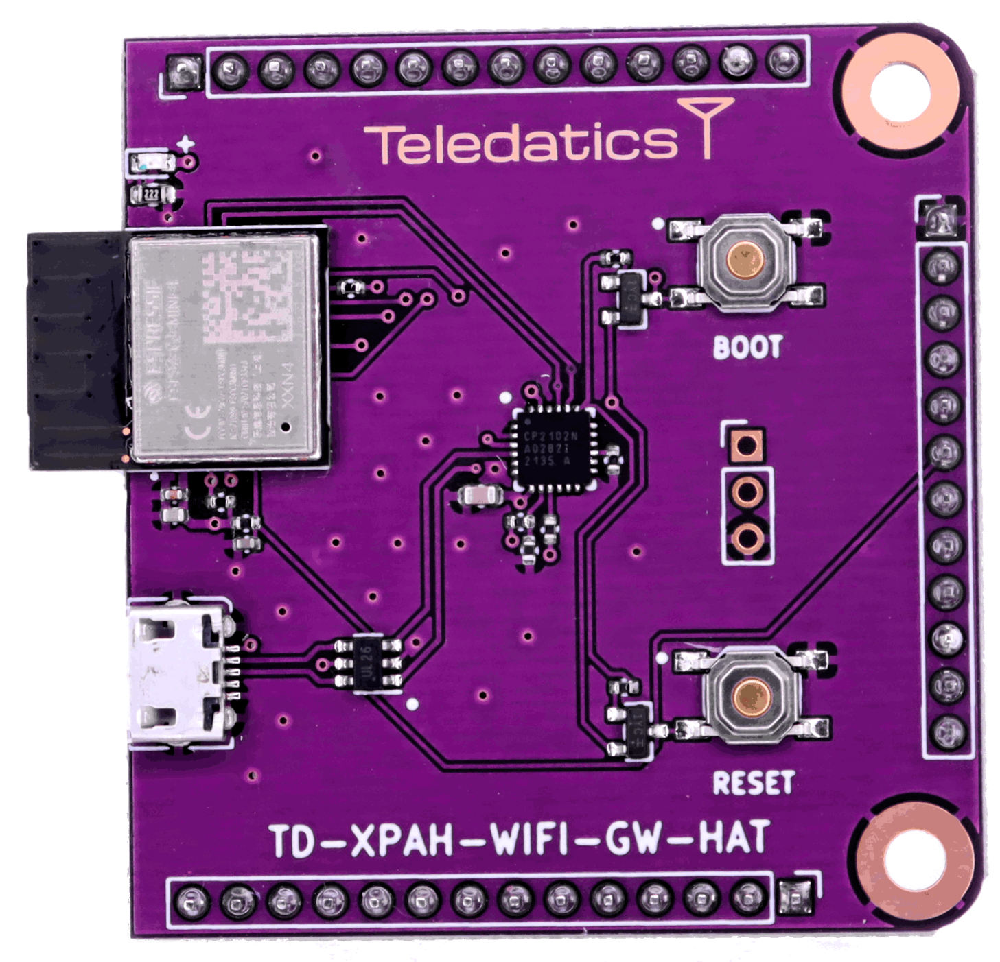

# TD-XPAH-WIFI-GW-HAT

## Wi-Fi Gateway Add-On

The **TD-XPAH-WIFI-GW-HAT** was developed from the Teledatics Kicad daughterboard 'hAT' [template](https://github.com/teledatics/TD-XPAH_hAT_template). The Kicad template can be installed in Kicad 6.x or newer versions.

The Teledatics GUI <i>standalone</i> mode firmware automatically recognizes and initializes the Wi-Fi Gateway hAT on boot.

The **TD-XPAH-WIFI-GW-HAT** uses the Espressif [ESP32-C3](https://docs.espressif.com/projects/esp-idf/en/latest/esp32c3/get-started/index.html) 2.4 GHz Wi-Fi chip with [esp-hosted](https://github.com/espressif/esp-hosted/blob/ESP-Hosted_MCU_Host/docs/MCU_based_host/MCU_based_readme.md) firmware. The esp-hosted firmware allows an external MCU to control the ESP32-C3 Wi-Fi & Bluetooth features over the SPI bus.

<i>All **TD-XPAH-WIFI-GW-HAT** boards come with the esp-hosted firmware already flashed to the accessory board.</i>

The latest version of the Teledatics GUI firmware must be downloaded to your **TD-XPAH** in order to use the Wi-Fi Gateway accessory board. Please [follow the instructions](/standalone.md) to re-flash your **TD-XPAH** board with the latest version of the Teledatics [GUI firmware](https://github.com/teledatics/nrc7292_sdk/blob/teledatics_gui/package/standalone/sdk/apps/teledatics-gui/nrc7292_standalone_xip_teledatics-gui.bin) for Wi-Fi Gateway functionality.

The [ESP32-C3](https://docs.espressif.com/projects/esp-idf/en/latest/esp32c3/get-started/index.html) module used on the accessory board can be flashed with the [esp-hosted](https://github.com/espressif/esp-hosted/blob/ESP-Hosted_MCU_Host/docs/MCU_based_host/MCU_based_readme.md) firmware by using the mini USB connection on the add-on board. Please follow the Espressif documentation to flash the [**TD-XPAH-WIFI-GW-HAT**](https://docs.espressif.com/projects/esp-idf/en/latest/esp32c3/hw-reference/esp32c3/user-guide-devkitm-1.html#getting-started). The flash procedure is identical to that for flashing the Espressif [ESP32-C3-DevKitM-1](https://docs.espressif.com/projects/esp-idf/en/latest/esp32c3/hw-reference/esp32c3/user-guide-devkitm-1.html).

